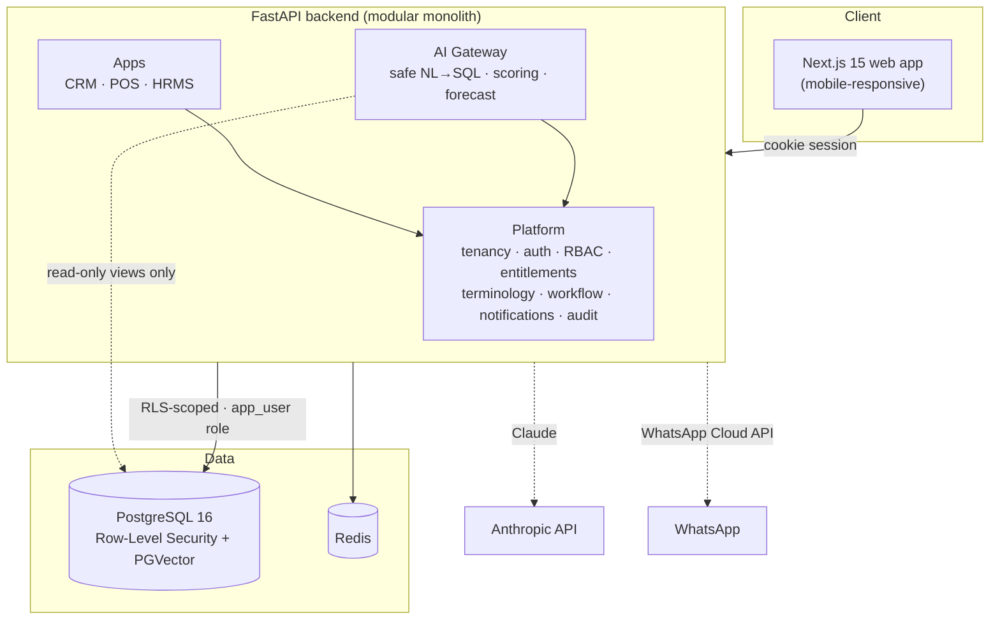

<div align="center">

# ⬢ Business OS

### The all-in-one, AI-powered operating system for your business

**CRM · POS · HRMS — in one app, that speaks your industry's language.**

<br/>

[](https://fastapi.tiangolo.com/)
[](https://nextjs.org/)
[](https://www.python.org/)
[](https://www.typescriptlang.org/)
[](https://www.postgresql.org/)
[](https://www.anthropic.com/)


</div>

---

## 🧭 What is this?

Most businesses juggle a separate app for sales, another for billing, another for staff — none of
which talk to each other, half of which never get adopted because they're too complex.

**Business OS is one modular platform.** A company activates only the modules it needs, and the
**entire interface re-labels itself to that industry** — a school sees *"Students,"* a shop sees
*"Customers,"* a clinic sees *"Patients."* Every action can be done the **manual way** (fast forms +
keyboard) or the **AI way** (just ask). The AI isn't a chatbot bolted on — it's an **active business
consultant** that scores leads, forecasts demand, and catches fraud across every module.

> **The wedge:** all-in-one + AI-native + **WhatsApp-first** + industry-localized + **flat PKR pricing**
> (no per-seat gouging) — exactly where Zoho / Odoo / Bitrix / HubSpot are weak in emerging markets.

---

## ✨ Highlights

| | Module | What it does |
|---|---|---|
| 🤝 | **CRM** | Drag-drop Kanban pipeline · fuzzy dedup · interaction logging · **lead scoring (1–100)** · industry-conditional fulfillment · **invoice → approve → PDF** (separation of duties) |
| 🛒 | **POS** | Keyboard-first billing (F1–F7) · barcode lookup · printable receipt · live stock · **predictive inventory** (velocity restock + **60-day seasonal forecast** — *"stock before Eid"*) |
| 👥 | **HRMS** | Employees · attendance with **mock-GPS anti-fraud flag** · leave approvals · **payroll with FBR tax slabs** |
| 🧠 | **AI Gateway** | One assistant everywhere — safe **NL→SQL** over tenant-scoped read-only views (injection-hardened) |
| ⚙️ | **Platform** | Multi-tenant · self-hosted auth · RBAC · module entitlements · **terminology engine** · workflow/ECA automations · notifications · audit log |

---

## 🏗️ Architecture



**Security by design:** every tenant-scoped table is protected by **Postgres Row-Level Security**.
Two DB roles — an owner (signup/login only) and a non-owner `app_user` for all runtime queries, where
each request sets `app.tenant_id` so the database *itself* blocks cross-tenant reads. The AI can only
touch curated, read-only, security-invoker views — never raw tables.

---

## 🧱 Tech stack

| Layer | Choice | Why |
|-------|--------|-----|
| **Backend** | FastAPI (Python 3.12), asyncpg | One service also hosts AI/ML |
| **Frontend** | Next.js 15, React 19, Tailwind v4 | Typed, fast, design-token system |
| **Database** | PostgreSQL 16 + RLS + PGVector | Relational + vector, tenant isolation |
| **Cache** | Redis | Sessions, jobs, geo |
| **Auth** | Self-hosted sessions (argon2 + httpOnly cookie) | Full data ownership |
| **AI** | Claude (Anthropic) | The "active consultant" |
| **PDF** | fpdf2 | On-demand invoices |
| **Infra** | Docker Compose · Cloudflare · Hostinger VPS | Cost-efficient, scale-ready |

---

## 🚀 Quick start

**Prereqs:** Docker Desktop · Node 20+ · Python 3.12

```bash
# 1 — clone & configure
git clone https://github.com/tahahasan01/Saas-suite.git && cd Saas-suite
cp .env.example .env          # then edit secrets

# 2 — infra (Postgres :5433, Redis :6379)
npm install
npm run db:up

# 3 — backend
cd services/api
python -m venv .venv
./.venv/Scripts/python -m pip install -r requirements.txt   # (Scripts on Windows, bin on *nix)
./.venv/Scripts/python -m scripts.migrate
./.venv/Scripts/python -m scripts.seed
./.venv/Scripts/python -m uvicorn app.main:app --port 4000 --reload

# 4 — frontend (new terminal, repo root)
npm run dev --workspace @business-os/web     # → http://localhost:3000
```

Sign up, pick an industry, and watch the UI re-label itself. 🎉

---

## 🗂️ Project structure

```
apps/web            Next.js unified app (all modules render here)
services/api        FastAPI backend
  app/platform      tenancy · auth · rbac · terminology · workflow · notifications
  app/routers       crm · pos · hrms · invoices · ai · workflows · team
  app/ai            AI gateway + NL→SQL guard
  tests             pytest (sql-guard · scoring · payroll · RLS)
packages/types      shared TS domain types
infra/docker        Postgres (pgvector) + Redis
infra/migrations    raw-SQL migrations (RLS policies)
docs/               architecture · strategy · competitive research
```

---

## ✅ Testing

```bash
cd services/api && ./.venv/Scripts/python -m pytest -q     # 21 passing
```

Covers the security- and money-critical paths: **NL→SQL injection defense**, lead scoring,
**FBR payroll math**, and **RLS cross-tenant isolation** — all run in CI on every push.

---

## 🗺️ Roadmap

| Phase | Status |
|-------|--------|
| Platform · CRM (+depth) · POS (+predictive inventory) · HRMS (+payroll) | ✅ Done |
| AI Gateway (live answers) | 🟡 Built — needs `ANTHROPIC_API_KEY` |
| WhatsApp channel (the wedge) | 🟡 Built — needs `WHATSAPP_TOKEN` |
| POS offline-first + hardware bridge · mobile attendance (face-match) | ⬜ Planned |

Full living checklist → [`ROADMAP.md`](./ROADMAP.md) · design docs → [`docs/`](./docs)

---

<div align="center">

**Built with a platform-first architecture so a fourth app is ~40% cheaper than the first.**

<sub>Multi-tenant · Row-Level-Security-isolated · industry-localized · AI-native</sub>

</div>
